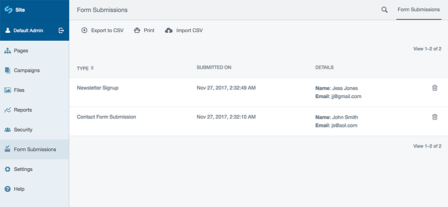

# Silverstripe Form Capture
Provides a method to capture simple silverstripe forms and a friendly admin interface for users.



## Installation
This version requires silverstripe 4, for 3.1+ compatibility see the 1.* branch.

Either clone/download this repository into a folder named 'silverstripe-form-capture' or run:

```
composer require andrewhaine/silverstripe-form-capture
```

## Initialisation
After installing you will need to run 'dev/build' and add the module extension to the form class or any subclass of form that you wish to store.

## Usage
To store submissions from a form simply add a call to the new method in the function you will use to handle the form. See the example below for usage

### Example
In the page controller:

```php
public function MyForm() {
	$fields = FieldList::create(
		TextField('ExampleTextField'),
		TextareaField::create('ExampleTextareaField')
	);

	$actions = FieldList::create(
		FormAction::create('doMyForm', 'Submit')
	);

	$form = Form::create($this, __FUNCTION__, $fields, $actions);

	return $form;
}

public function doMyForm($data, $form) {
	$form->captureForm();

	// Other processing
}
```
When capturing a form some useful information is returned which can be used in the controller. For example a link is returned to the submission area in the CMS.
```php
$capturedSubmission = $form->captureForm();

echo($capturedSubmission['Link']);
// http://your-site.com/admin/<Link to exact submission>

```

### Options
When calling the captureForm() there are a few optional parameters which will enhance how submission objects are displayed in the CMS.

* __Form Submission Title__ - A string which will be displayed as the submission title in the admin area (defaults to 'Form Submission').
* __Excluded Fields__ - An array of field names which will not be stored, this can also be a string containing the name of a single field to exclude.
* __Details Fields__ - An array of fields which will be included in the 'details' column of the gridfield, this can also be a string containing the name of a single field to include in the details.

#### Example

```php
$form->captureForm('Contact Form Submission', ['IDontWantThisField', 'OrThisOne'], 'Details');
```
